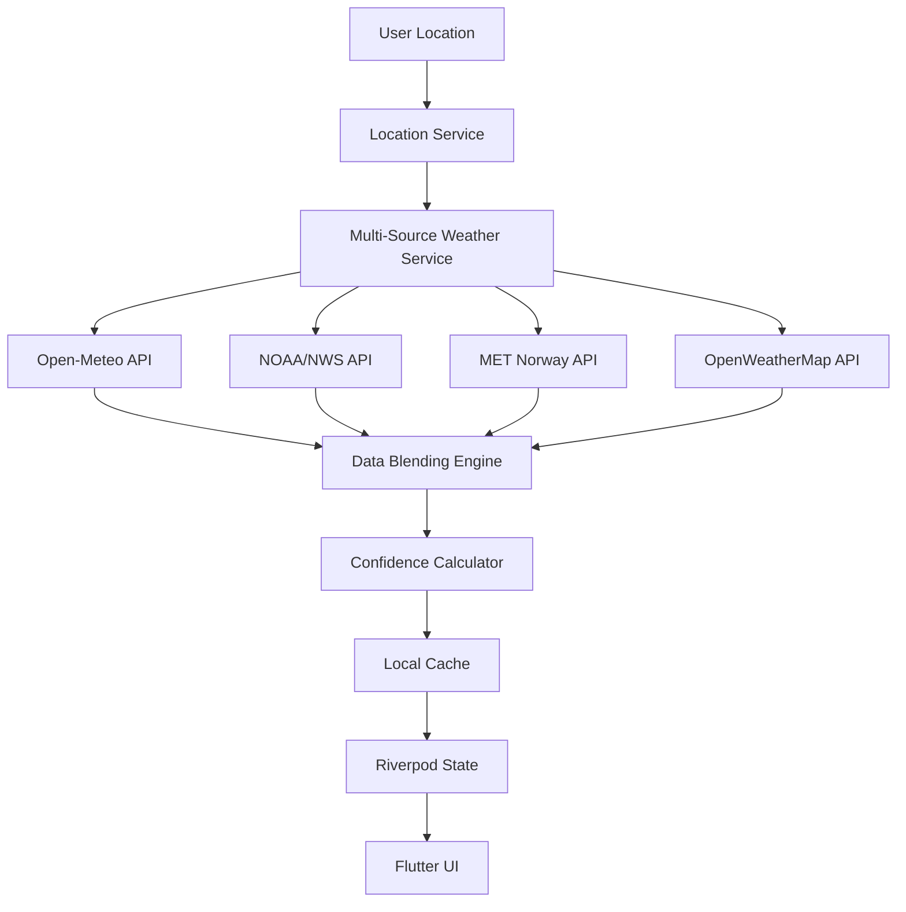

# Miscellaneous Projects

- Fiber Polisher.dwg
- OSILLATOR BOX.dwg
- Torque Motor.dwg
- Kufta Maker.dwg
- Spool holder.dwg
- Trash Mount.dwg

# 🌤️ Weather Forecast App

A stunning Apple Weather-inspired mobile app that combines multiple free weather APIs to deliver the most accurate forecasts possible. Built with Flutter for cross-platform deployment with intelligent data blending, beautiful UI animations, and offline functionality.

<div align="center">
  
  
  
</div>

## ✨ Features

### 🎨 Apple Weather-Inspired Design
- **Beautiful gradients** that change based on weather conditions
- **Smooth parallax scrolling** with dynamic backgrounds
- **Glassmorphism effects** and subtle animations
- **SF Pro font family** for authentic Apple aesthetics
- **Dark/Light mode** support with automatic switching

### 🔄 Multi-Source Intelligence
- **Open-Meteo**: Free, high-accuracy global weather data
- **NOAA/NWS**: US weather alerts and high-precision forecasts  
- **MET Norway**: Excellent European weather coverage
- **OpenWeatherMap**: Global coverage with air quality data
- **Weatherbit**: Additional validation and backup data

### 📊 Advanced Features
- **Confidence indicators** showing forecast reliability
- **Data source transparency** with weighted averaging
- **Intelligent blending algorithms** for maximum accuracy
- **Offline functionality** with smart caching
- **Background updates** with battery optimization
- **Interactive weather maps** (planned)

### 🏠 Home Screen
- Large temperature display with weather animations
- Current conditions with location-based gradients
- "Feels like" temperature and quick stats
- Hourly forecast (24 hours) with precipitation probability
- 10-day extended forecast with temperature ranges
- Detailed weather metrics (humidity, wind, pressure, UV, etc.)
- Air quality index when available
- Sunrise/sunset times with daylight progress

### 📍 Location Features
- **GPS location detection** with permission handling
- **Location search** with geocoding
- **Favorite locations** management
- **Multiple location support** with easy switching

## 🏗️ Architecture

### Frontend (Flutter)
```
lib/
├── main.dart                 # App entry point with initialization
├── models/                   # Data models and DTOs
│   └── weather_models.dart   # Weather data structures with Hive caching
├── services/                 # Business logic and API integration
│   ├── weather_api_service.dart  # Multi-source weather service
│   └── location_service.dart     # GPS and location management
├── providers/                # State management (Riverpod)
│   ├── weather_provider.dart     # Weather data state
│   ├── location_provider.dart    # Location state
│   └── theme_provider.dart       # Theme and UI state
├── screens/                  # UI screens
│   ├── weather_home_screen.dart  # Main weather interface
│   ├── onboarding_screen.dart    # First-time setup
│   └── location_search_screen.dart  # Location management
├── widgets/                  # Reusable UI components
│   ├── weather_main_card.dart     # Main weather display
│   ├── hourly_forecast_card.dart  # Hourly forecast list
│   ├── daily_forecast_card.dart   # 10-day forecast
│   └── weather_detail_card.dart   # Detailed metrics
└── theme/                    # Design system
    └── app_theme.dart            # Colors, typography, gradients
```

### Data Flow


## 🚀 Getting Started

### Prerequisites
- Flutter SDK 3.13.0 or higher
- Dart SDK 3.1.0 or higher
- Android Studio / VS Code with Flutter extensions
- Device or emulator for testing

### Installation

1. **Clone the repository**
   ```bash
   git clone https://github.com/yourusername/weather-forecast-app.git
   cd weather-forecast-app
   ```

2. **Install dependencies**
   ```bash
   flutter pub get
   ```

3. **Generate code** (for Hive adapters and JSON serialization)
   ```bash
   flutter packages pub run build_runner build --delete-conflicting-outputs
   ```

4. **Run the app**
   ```bash
   flutter run
   ```

### Configuration

The app works with free APIs out of the box. For enhanced features, you can add API keys:

1. Open `lib/services/weather_api_service.dart`
2. Replace placeholder API keys:
   ```dart
   // OpenWeatherMap (optional - for air quality data)
   const apiKey = 'YOUR_OPENWEATHERMAP_API_KEY';
   
   // Weatherbit (optional - for additional validation)
   const apiKey = 'YOUR_WEATHERBIT_API_KEY';
   ```

## 🔧 Key Technologies

### Dependencies
- **flutter_riverpod** - State management
- **dio** - HTTP client for API requests
- **hive** - Local database for caching
- **geolocator** - GPS location services
- **geocoding** - Address to coordinate conversion
- **intl** - Internationalization and date formatting
- **connectivity_plus** - Network connectivity detection

### Development Dependencies
- **build_runner** - Code generation
- **json_serializable** - JSON serialization
- **hive_generator** - Hive type adapters
- **very_good_analysis** - Strict linting rules

## 📱 Screenshots

*Note: Add screenshots here showing the main weather screen, hourly forecast, daily forecast, and settings*

## 🌐 API Sources

### Primary (Always Free)
- **Open-Meteo**: No API key required, excellent accuracy
- **NOAA/NWS**: US-only, government weather service
- **MET Norway**: Global coverage, especially accurate for Europe

### Secondary (Free Tier)
- **OpenWeatherMap**: 60 calls/min free, air quality data
- **Weatherbit**: 500 calls/day free, good for validation

## 🏆 Weather Data Accuracy

The app implements intelligent forecast blending:

```dart
// Weighted averaging based on source reliability
final blendedTemperature = (
  openMeteoTemp * 1.0 +     // Highest weight
  noaaTemp * 0.95 +         // Very high for US
  metNorwayTemp * 0.9 +     // High for Europe
  openWeatherTemp * 0.8     // Good baseline
) / totalWeight;
```

Confidence calculation considers:
- Agreement between sources
- Historical accuracy
- Data recency
- Geographic relevance

## 🎨 Design System

### Color Palette
- **Sunny**: `#FDCB6E` to `#E17055`
- **Cloudy**: `#636E72` to `#2D3436`
- **Rainy**: `#74B9FF` to `#0984E3`
- **Snowy**: `#DDD6FE` to `#A29BFE`
- **Night**: `#2C3E50` to `#34495E`

### Typography
- **Primary**: SF Pro Display (headings)
- **Secondary**: SF Pro Text (body)
- **Weights**: Light (100), Regular (400), Medium (500), Semibold (600), Bold (700)

## 🔒 Privacy & Permissions

- **Location**: Required for weather forecasts
- **Network**: Required for fetching weather data
- **Storage**: Used for offline caching and preferences

No personal data is collected or transmitted. Location data is only used for weather requests and cached locally.

## 🚀 Future Enhancements

### Planned Features
- [ ] Interactive weather radar maps
- [ ] Weather alerts and notifications
- [ ] Widget support (iOS/Android)
- [ ] Apple Watch companion app
- [ ] Advanced weather charts
- [ ] Historical weather data
- [ ] Weather photography integration

### Technical Improvements
- [ ] More sophisticated blending algorithms
- [ ] Machine learning for accuracy improvement
- [ ] Better offline map support
- [ ] Enhanced accessibility features
- [ ] Unit testing coverage
- [ ] Performance optimizations

## 🤝 Contributing

1. Fork the repository
2. Create a feature branch (`git checkout -b feature/amazing-feature`)
3. Commit your changes (`git commit -m 'Add amazing feature'`)
4. Push to the branch (`git push origin feature/amazing-feature`)
5. Open a Pull Request

### Development Guidelines
- Follow the existing code style
- Add tests for new features
- Update documentation as needed
- Ensure all lints pass

## 📄 License

This project is licensed under the MIT License - see the [LICENSE](LICENSE) file for details.

## 🙏 Acknowledgments

- **Apple Weather** - Design inspiration
- **Open-Meteo** - Free, high-quality weather data
- **NOAA/NWS** - Reliable US weather information  
- **MET Norway** - Excellent European weather coverage
- **Flutter Team** - Amazing cross-platform framework

---

<div align="center">
  <p>Made with ❤️ and ☁️ for weather enthusiasts</p>
  <p>
    <a href="#top">Back to top</a>
  </p>
</div>

