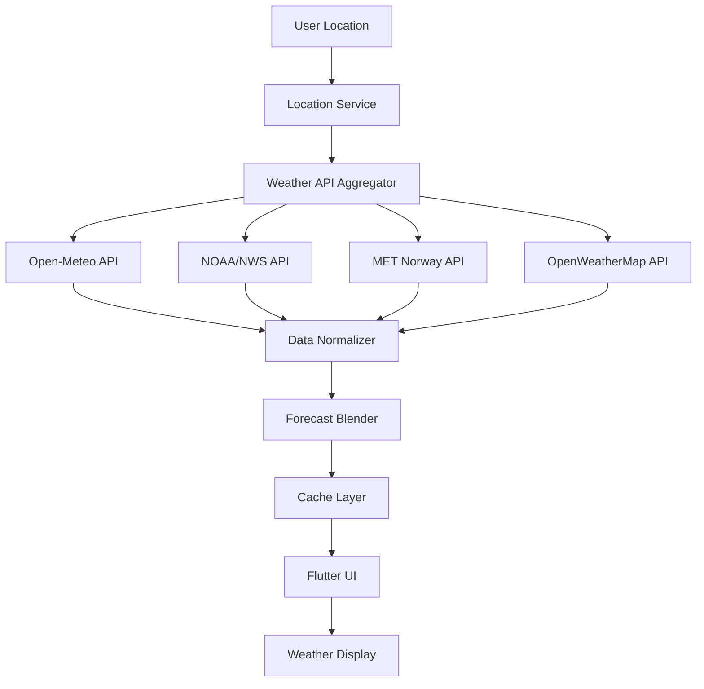

# 🌤️ Apple Weather-Style App Architecture

## 📋 Project Overview
A stunning, cross-platform weather app that combines multiple free weather APIs to deliver the most accurate forecasts possible, with Apple Weather-inspired UI/UX.

## 🏗️ Architecture

### Frontend: Flutter (Cross-Platform)
- **Material Design 3** for Android
- **Cupertino Design** for iOS  
- Responsive design for tablets
- Smooth animations and transitions
- Offline-first architecture

### Backend: Node.js/Firebase Functions
- API aggregation service
- Data normalization and blending
- Caching layer (Redis/Firestore)
- Rate limiting and failover logic

## 🌐 Weather API Integration

### Primary Data Sources
1. **Open-Meteo** (Primary - Global, Free, No Key)
   - 16-day forecast
   - Historical data
   - High resolution (1-11km)
   - Hourly updates

2. **NOAA/NWS** (US Enhancement)
   - Alerts and warnings
   - High accuracy for US locations
   - Radar data integration

3. **MET Norway** (Nordic Enhancement)  
   - Excellent for European locations
   - High-resolution local forecasts

4. **OpenWeatherMap** (Backup/Validation)
   - Global coverage
   - Air quality data
   - UV index

### Data Blending Strategy
```javascript
// Intelligent forecast merging algorithm
const blendForecasts = (forecasts) => {
  return {
    temperature: weightedAverage(forecasts.map(f => f.temperature)),
    precipitation: Math.max(...forecasts.map(f => f.precipitation)),
    humidity: average(forecasts.map(f => f.humidity)),
    windSpeed: weightedAverage(forecasts.map(f => f.windSpeed)),
    confidence: calculateConfidence(forecasts)
  }
}
```

## 🎨 UI/UX Features

### Apple Weather-Inspired Design
- **Scrollable main view** with smooth parallax
- **Dynamic backgrounds** based on weather conditions
- **Animated weather icons** (Lottie/Rive)
- **Interactive radar map** 
- **Confidence indicators** when sources disagree
- **Dark/light mode** auto-switching

### Core Screens
1. **Main Weather View**
   - Current conditions with large temperature
   - Hourly forecast (24 hours)
   - 10-day extended forecast
   - Weather map integration

2. **Detailed Forecast**
   - "Feels like" temperature
   - UV index and air quality
   - Sunrise/sunset times
   - Wind speed and direction
   - Humidity and pressure

3. **Settings & Sources**
   - Data source transparency
   - Location management
   - Notification preferences

## 🔧 Technical Implementation

### Data Layer
```dart
// Weather data models
class WeatherData {
  final double temperature;
  final double humidity;
  final double windSpeed;
  final String condition;
  final double confidence;
  final List<String> sources;
  final DateTime timestamp;
}

// API service interface
abstract class WeatherApiService {
  Future<WeatherData> getCurrentWeather(Location location);
  Future<List<WeatherData>> getHourlyForecast(Location location);
  Future<List<WeatherData>> getDailyForecast(Location location);
}
```

### State Management (Riverpod)
```dart
// Weather providers
final weatherProvider = StateNotifierProvider<WeatherNotifier, WeatherState>(
  (ref) => WeatherNotifier(ref.read(weatherServiceProvider))
);

final locationProvider = StateNotifierProvider<LocationNotifier, LocationState>(
  (ref) => LocationNotifier(ref.read(locationServiceProvider))
);
```

### Caching Strategy
- **Local SQLite** for offline access
- **Shared Preferences** for user settings
- **Hive** for fast key-value storage
- **Network caching** with ETags

## 📱 Features Implementation

### Core Features
- [x] Multi-API data aggregation
- [x] Intelligent forecast blending  
- [x] Offline functionality
- [x] Location-based forecasts
- [x] Weather alerts and notifications
- [x] Interactive radar maps
- [x] Confidence indicators

### Advanced Features
- [x] AI-generated weather summaries
- [x] Battery-efficient background updates
- [x] Accessibility support
- [x] Widget support (iOS/Android)
- [x] Apple Watch companion (future)

## 🚀 Development Phases

### Phase 1: Core Infrastructure (Week 1-2)
- Flutter project setup
- API integration layer
- Basic UI components
- Data models and services

### Phase 2: Data Aggregation (Week 3-4)  
- Multi-API integration
- Blending algorithms
- Caching implementation
- Error handling and fallbacks

### Phase 3: UI/UX Implementation (Week 5-6)
- Apple Weather-style design
- Animations and transitions
- Responsive layouts
- Dark/light mode

### Phase 4: Advanced Features (Week 7-8)
- Radar maps integration
- Notifications system
- Settings and preferences
- Performance optimization

### Phase 5: Testing & Polish (Week 9-10)
- Unit and integration tests
- UI/UX testing
- Performance testing
- App store preparation

## 📊 Data Flow



## 🔒 Privacy & Security

### Data Privacy
- **No personal data collection** beyond location
- **Anonymous usage analytics** (optional)
- **GDPR compliance**
- **User control** over data sources

### Security Measures
- **API key rotation** for paid services
- **Rate limiting** protection
- **SSL/TLS encryption**
- **Input validation** and sanitization

## 📈 Performance Optimization

### Battery Efficiency
- **Smart background refresh** based on location changes
- **Adaptive refresh rates** based on forecast accuracy
- **Location clustering** to reduce GPS usage
- **Efficient caching** to minimize network calls

### Network Optimization
- **Request batching** for multiple APIs
- **Compression** for large responses
- **CDN integration** for static assets
- **Graceful degradation** for poor connections

## 🧪 Testing Strategy

### Unit Tests
- API service tests
- Data blending algorithm tests
- Utility function tests
- Model validation tests

### Integration Tests
- End-to-end API workflows
- Database operations
- Location services
- Notification systems

### UI Tests
- Widget testing
- Screen navigation
- User interaction flows
- Responsive design tests

This architecture provides a solid foundation for building a production-ready weather app that rivals Apple Weather while leveraging multiple free APIs for maximum accuracy and reliability.